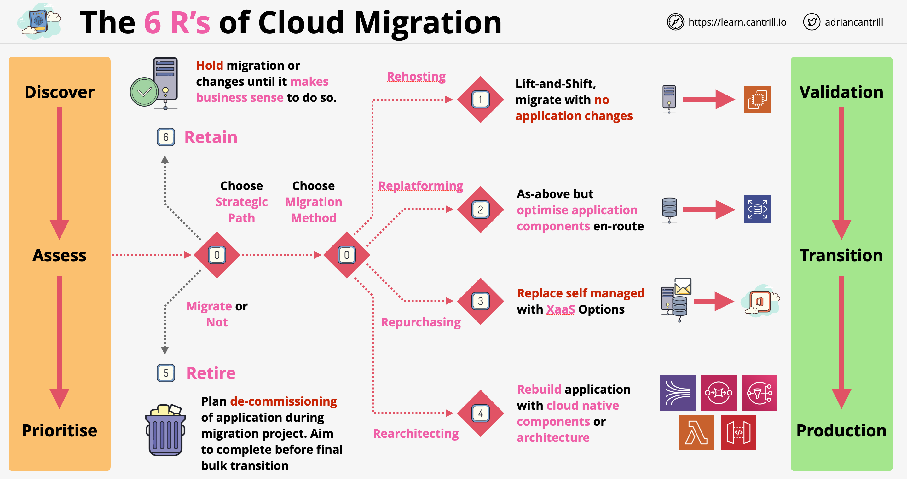

# The 6R's of Cloud Migrations

- Are a set of 6 different strategies of migrating systems into the cloud
- Starting point of a migration is the *discover*, *assess* and *prioritize* all the applications to migrate
- Once we have done this, there are 6 different ways of doing migrations:
    - **Rehosting**: lif and shift
    - **Replatforming**: lift and shift with optimizations
    - **Repurchase**: migrate the application while using something newer, example SaaS
    - **Refactoring / Re-architecting**: take advantage of the feature offered by the cloud
    - **Retire**: dump the applications which are no longer needed
    - **Retain**: do not migrate the application, not worth the time and money or it is too scary to migrate

## Rehosting

- Lift and shift or migrate as is: move the application with the least amount of changes into the cloud
- Generally used with legacy or monolithic applications
- Reasons to do application rehosting:
    - Reduce admin overhead using IaaS
    - Potentially easier to optimize the application when is running in the cloud compared to working with legacy tooling
    - Cost savings, consuming a certain type of instances
- Negatives:
    - We wont be able to take advantage of the full Cloud offerings
    - Potentially "kicking the can down the road" - delaying what we can do today until tomorrow
- For doing rehosting we can use VM Import/Export tools and Server Migration Service

## Replatforming

- Similar to rehosting with the addition of applying certain optimizations to the applications as part of the migration process
- We might decide to use RDS instead of self-managed database instances
- We might use ELB's instead of self managed load balancers
- We might use S3 as a backup or media storage
- Replatforming approach brings no real negatives but also no world-changing benefits
- Potential benefits of migration:
    - Admin overhead reduction
    - Performance benefits
    - More effective backups
    - Improved HA/FT

## Repurchasing

- Unless we have a reason to use self-managed application, we would rather use XaaS products
- Examples of this kind of migrations:
    - MS Exchange => Microsoft 365
    - Self managed CRM => SalesForce
    - Self managed payroll => Xero
- Using a managed service reduces admin overhead, costs and risks. Almost always a preferred option

## Refactoring / Re-architecting

- Requires a full review of the architecture of an application
- The aim is to adopt cloud-native architecture and products
- We might look at adopting service-origin and microservice based architectures
- We might adopt a more API based architecture, event-driven architecture or serverless architecture
- This approach is initially very expensive and time-consuming
- In the long term it does offer the best benefits compared to other types of migrations

## Retire

- Systems are often running for no reasons
- Auditing their usage is often more work than leaving them to run
- A migration is perfect time to re-evaluate the usefulness of an application. If we don't need it, we should switch if off
- Often saves 10% to 20% cost in case of large scale migration

## Retain

- Essentially do nothing
- For some application the usage is uncertain with some complicating factors against being able to retire it or migrate it to the cloud
- In other cases some old applications might have some usage, but it wont worth the effort to move them to the cloud
- Or we might have a complex application - leave it till later
- Super-import application - risky to move
- The best advice is to complete the migration of other applications and swing back to focus on the left-overs

## 6R Migration Plan

