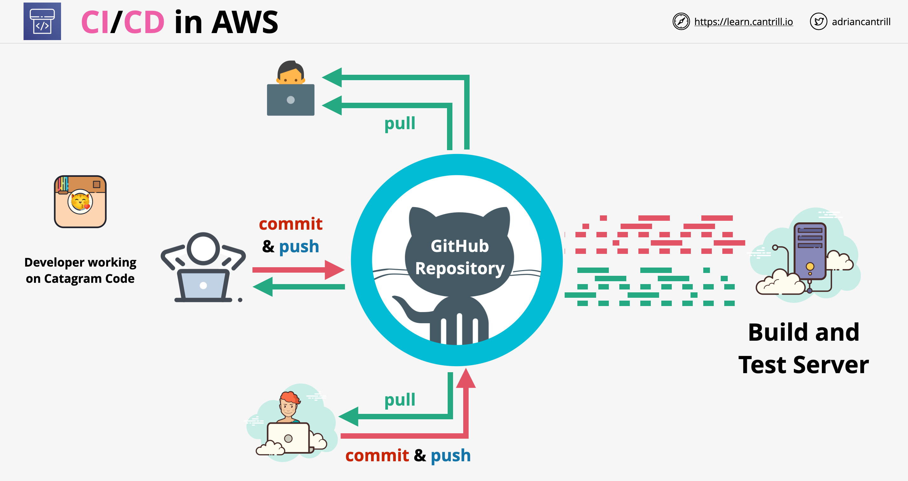
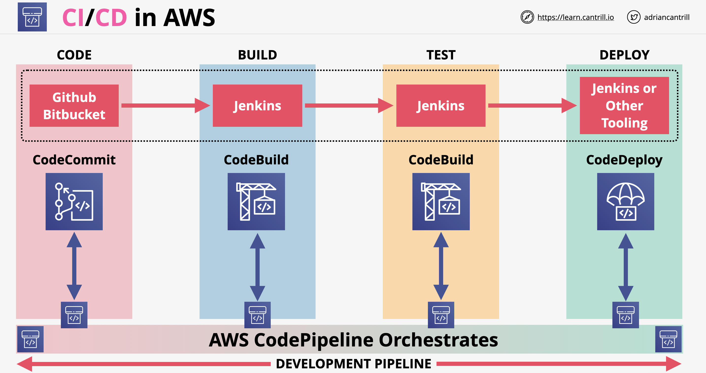
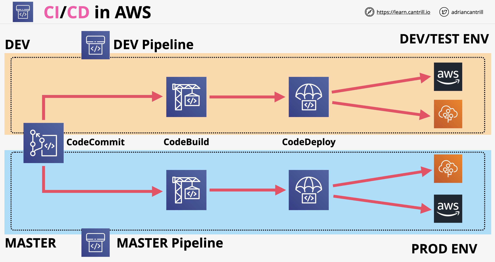

# CI/CD

- CI/CD architecture:
    
- Branching architecture:
    
- Code pipeline:
    
- Each pipeline has stages
- Each pipeline should be linked to a single branch in a repository
    
- CodeBuild/CodeDeploy configuration files:
    - `buildspec.yml, appspec.[yml|json]`
    - Reference to these files: [https://docs.aws.amazon.com/codedeploy/latest/userguide/reference-appspec-file.html](https://docs.aws.amazon.com/codedeploy/latest/userguide/reference-appspec-file.html)
    - buildspec is used to influence the way the build process occurs within CodeBuild
    - appspec allows the influence how the deployment process proceeds in CodeDeploy

## AWS CodeCommit

- Managed git service
- Basic entity of CodeCommit is a repository
- Authentication can be configured via IAM console. CodeCommit supports HTTPS, SSH and HTTPS over GRPC
- Triggers and notifications:
    - Notifications rules: can send notifications based on events happening in the repo, example: commits, pull request, status changes, etc. Notifications can be sent to SNS topics or AWS chat bots
    - Triggers: allow the generate event driven processes based on things that happen in the repo. Events can be sent ot SNS or Lambda functions

## AWS CodePipeline

- It is a Continuos Delivery Tools
- Controls the flow from source code, through build towards deployment
- A pipeline is build from stages. These contain actions which can be sequential or parallel
- Movement between stages can happen automatically or it can require a manual approval
- Action can consume artifacts or they can generate artifacts
- Artifacts are just files which are generated and/or consumed by actions
- Any changes to the sate of pipelines, stages or actions generate events which are published to Event Bridge
- CloudTrail or Console UI can be used to view/interact with the pipeline

## AWS CodeBuild

- CodeBuild is a build as a service product
- It is fully managed, we pay only for the resources consumed during builds
- CodeBuild is an alternative to the solutions provided by third party solutions such as Jenkins
- CodeBuild uses Docker for build environments which can be customized by us
- CodeBuild integrates with other AWS services such as KMS, IAM, VPC, CloudTrails, S3, etc.
- Architecturally CodeBuild gets source material from GitHub, CodeCommit, CodePipeline or even S3
- It builds and tests code. The build can be customized via `buildspec.yml` file which has to be located in the root of the source
- CodeBuild output logs are published to CloudWatch Logs, metrics are also published to CloudWatch Metrics and events to Event Bridge (or CloudWatch Events)
- CodeBuild supports build environments such as Java, Ruby, Python, Node.JS, PHP, .NET, Go and many more

### `buildspec.yml`

- It is used to customize the build process
- It has to be located in root folder of the repository
- It can contain four main phases:
    - `install`: used to install packages in the build environment
    - `pre_build`: sign-in to things or install code dependencies
    - `build`: commands run during the build process
    - `post_build`: used for packaging artifacts, push docker images, explicit notifications
- It can contain environment variables: shell, variables, parameter-store, secret-manager variables
- `Artifacts` part of the file: specifies what stuff to put where

## AWS CodeDeploy

- Is a code deployment as a service product
- It is an alternative for for third-party services such as Jenkins, Ansible, Chef, Puppet and even CloudFormation
- It is used to deploy code, not resources (use CloudFormation for that)
- CodeDeploy can deploy code to EC2, on-premises, Lambda and Ecs
- Besides code, it can deploy configurations, executables, packages, scripts, media and many more
- CodeDeploy integrates with other AWS services such as AWS Code*
- In order to deploy code on EC2 and on-premises, CodeDeploy requires the presence of an agent

### `appspec.[yaml|json]`

- It controls how deployments occur on the target
- Manages deployments: configurations + lifecycle event hooks
- Configuration section:
    - Files: applies to EC2/on-premises. Provides information about which files should be installed on the instance
    - Resources: applies to ECS/Lambda. For Lambda it contains the name, alias, current version and target version of a Lambda function. For ECS contains things like the task definition and container details (ports, traffic routing)
    - Permissions: applies to EC2/on-premises. Details any special permissions and how should be applies to files and folders from the files sections
- Lifecycle event hooks:
    - `ApplicationStop`: happens before the application is downloaded. Used for gracefully stop the application
    - `DownloadBundle`: agent copies the application to a temp location
    - `BeforeInstall`: used for pre-installation tasks
    - `Install`: agent copies the application from the temp folder to the final location
    - `AfterInstall`: perform post-install steps
    - `ApplicationStart`: used to restart/start services which were stopped during the `ApplicationStop` hook
    - `ValidateService`: verify the deployment was completed successfully